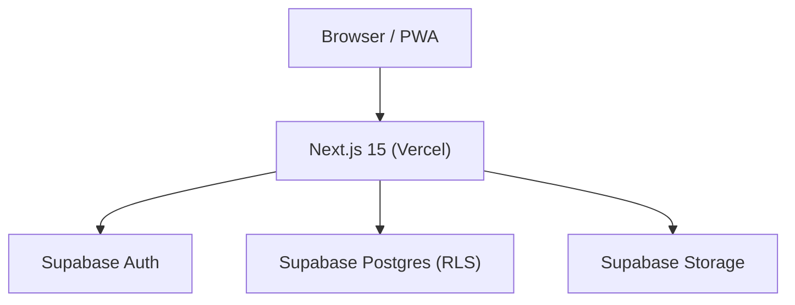
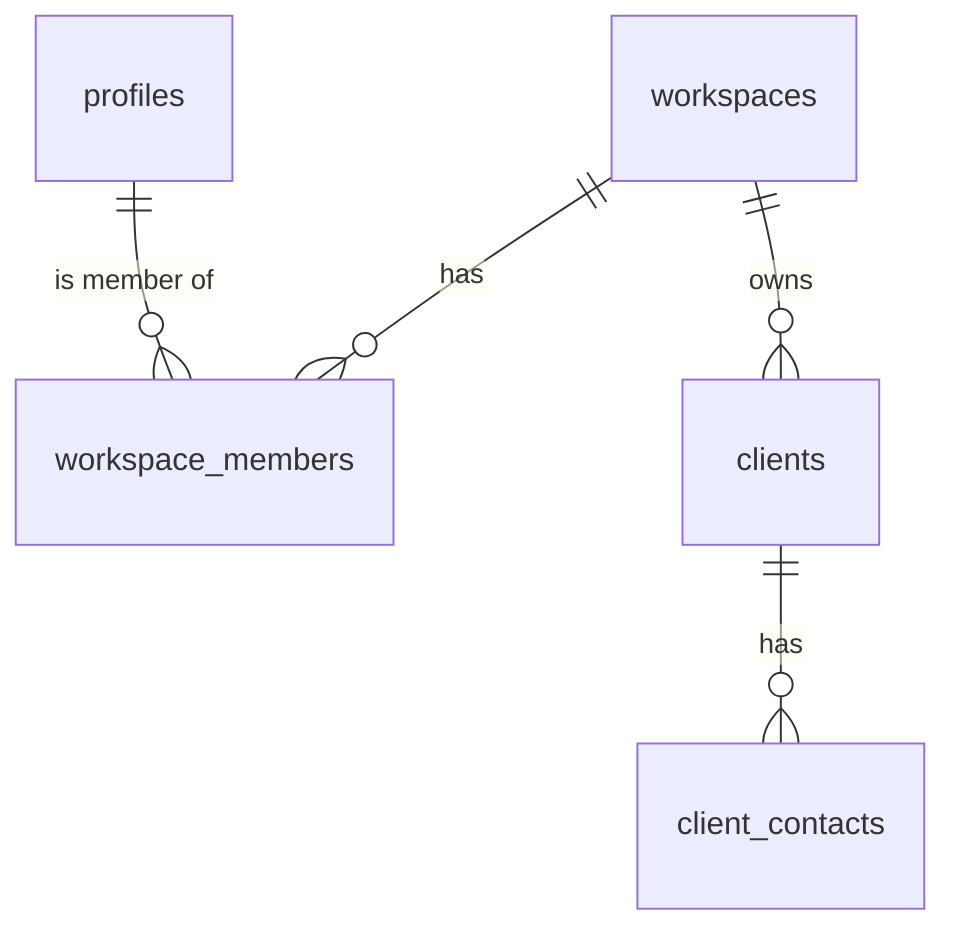

# Okei Agency — Architecture Reference

## 1. System Overview

Okei Agency is a SaaS management system for digital marketing agencies. Multi-tenant (workspace-per-agency). Centralizes clients, projects, tasks, finances, brand assets, and team.



**Stack:**
- Frontend: Next.js 15 + TypeScript + App Router
- UI: Tailwind CSS + shadcn/ui
- Backend: Next.js Server Actions + Route Handlers
- Database: Supabase (Postgres + RLS)
- Auth: Supabase Auth
- Deploy: Vercel

## 2. Repository Structure

```
app/             Next.js App Router pages
components/      React components (ui/ = shadcn, layout/, shared/, feature/)
lib/             Business logic (actions/, hooks/, validations/, supabase/)
providers/       React context providers
types/           TypeScript types (database.types.ts = generated, app.types.ts = domain)
supabase/        DB migrations and config
docs/            Architecture docs (this folder = Obsidian vault)
public/          Static assets + PWA manifest
middleware.ts    Supabase session refresh + route guard
```

**Do not hand-edit:**
- `components/ui/*` — shadcn auto-generated
- `types/database.types.ts` — regenerate via `npx supabase gen types typescript --local`

## 3. Data Architecture

Multi-tenancy via `workspace_id` column + RLS on every table.



**RLS helpers:** `is_workspace_member(ws_id)`, `workspace_role(ws_id)` — defined in migration 0001.

**Migration rules:**
- Sequential numbered files: `NNNN_description.sql`
- Never edit past migrations — create new ones

## 4. Authentication & Authorization

- Auth: Supabase Auth (email+password, magic link)
- Session: refreshed in `middleware.ts` on every request
- Profile: auto-created via Postgres trigger on `auth.users` INSERT
- Roles: `owner > admin > member > viewer`
- Route protection: `middleware.ts` redirects unauthenticated users to `/login`
- Workspace isolation: enforced at DB level via RLS

## 5. Module Registry

| Module | Status | Phase | Route | Primary Tables |
|---|---|---|---|---|
| Auth | ✅ Done | 1 | /login, /register | auth.users, profiles |
| Onboarding | ✅ Done | 1 | /create-workspace | workspaces, workspace_members |
| Dashboard Shell | ✅ Done | 1 | /[slug] | — |
| Clients | ✅ Done | 1 | /[slug]/clients | clients, client_contacts |
| Projects | 🔜 Planned | 2 | /[slug]/projects | projects |
| Tasks | 🔜 Planned | 2 | /[slug]/tasks | tasks |
| Financial | 🔜 Planned | 3 | /[slug]/financial | invoices, expenses |
| Brand & Assets | 🔜 Planned | 3 | /[slug]/assets | assets |
| Team | 🔜 Planned | 2 | /[slug]/team | workspace_members |
| Reports | 🔜 Planned | 4 | /[slug]/reports | — |
| Settings | 🔜 Planned | 2 | /[slug]/settings | workspaces |

## 6. API & Server Actions Pattern

**Use Server Actions for:** all mutations (create, update, delete), form submissions.  
**Use Route Handlers for:** webhooks, public API, file uploads.

Standard return type: `ActionResult<T>` = `{ data: T | null, error: string | null, success: boolean }`

File naming: `lib/actions/[entity].actions.ts`

## 7. Component Architecture

Three layers:
1. `components/ui/` — shadcn primitives (DO NOT EDIT)
2. `components/shared/` — reusable app-level components
3. `components/[feature]/` — feature-specific components

Form pattern: `react-hook-form` + `zod` schema + Server Action

## 8. Styling System

- Tailwind v4 utility-first
- `cva()` for variants, `cn()` for merging
- CSS variables for brand tokens in `globals.css`
- Responsive breakpoints: `sm:640px`, `md:768px`, `lg:1024px`, `xl:1280px`

## 9. HARNESS Methodology

Each agent receives a scoped execution plan. Rules:
- Never exceed phase scope
- Never modify `components/ui/*` or generated types
- Run `npm run build` before completing
- Document deviations before implementing

## 10. Deployment

- Vercel: connect repo, set env vars from `.env.example`
- Supabase: run migrations via dashboard SQL editor or CLI
- PWA: `public/manifest.json` + icons in `public/icons/`

Required env vars:
```
NEXT_PUBLIC_SUPABASE_URL
NEXT_PUBLIC_SUPABASE_ANON_KEY
NEXT_PUBLIC_APP_URL
```

## 11. Obsidian Vault

The `docs/` folder is the Obsidian vault. Files reflect live app state:
- `ARCHITECTURE.md` — this file, updated each phase
- `CONVENTIONS.md` — coding rules for agents
- `DATABASE.md` — full schema reference
- `phases/PHASE-N.md` — phase-specific deliverables and status
